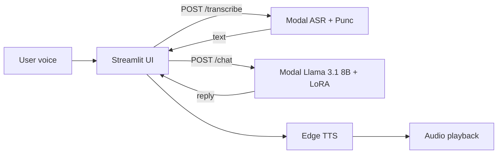
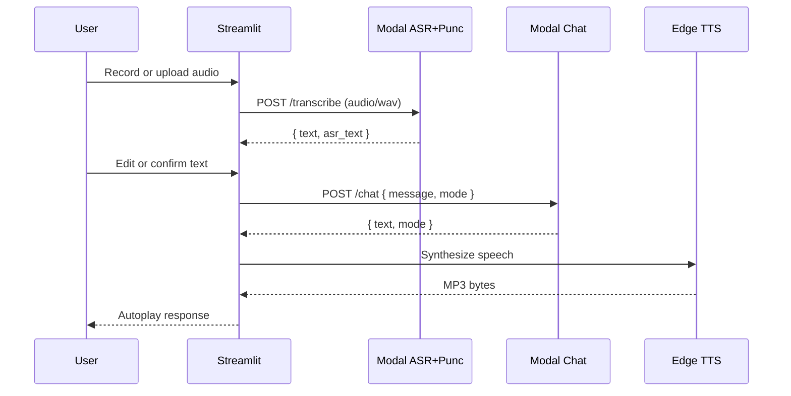

# SunaSunau Streamlit App

SunaSunau is a Nepali voice assistant with three ML stages: speech recognition, punctuation restoration, and a Nepali chat model. The Streamlit UI captures audio, calls Modal-hosted inference endpoints, and plays back TTS output.

## Architecture at a glance

- **Streamlit UI**: handles audio input, text editing, and response playback
- **Modal API**: hosts the ASR + punctuation pipeline and the chat model
- **Models on volumes**: ASR + punctuation stored on Modal Volume, LoRA adapter and Llama base cached in separate volumes



## ML models

### ASR (speech to text)

- **Model**: Wav2Vec2 CTC (Transformers)
- **Location**: Modal volume mounted at `/models`, loaded from `/models/models/asr`
- **Runtime**: CPU in Modal
- **Output**: raw Nepali transcript (no punctuation)

### Punctuation restoration

- **Model**: Token classification (Transformers) with labels `O`, `PERIOD`, `COMMA`, `QUESTION`
- **Location**: Modal volume mounted at `/models`, loaded from `/models/models/punc`
- **Runtime**: CPU in Modal
- **Output**: transcript with restored punctuation marks

### Nepali chat model

- **Base model**: Llama 3.1 8B Instruct
- **Adapter**: LoRA adapter on a dedicated Modal volume mounted at `/adapter`
- **Quantization**: 4-bit NF4 with bitsandbytes
- **Runtime**: GPU (T4) in Modal
- **Modes**: `factual` and `emotional` (two prompt configs with different decoding params)

## Inference pipeline



## Modal hosting details

Modal app definition is in [modal_app.py](../modal_app.py). It exposes a FastAPI app with two endpoints:

- `POST /transcribe`
  - Input: multipart file named `file` (wav/mp3 supported; converted to 16 kHz mono)
  - Output: JSON with `asr_text` and punctuated `text`
- `POST /chat`
  - Input: JSON `{ "message": "...", "mode": "factual" | "emotional" }`
  - Output: JSON `{ "text": "...", "mode": "..." }`

Modal configuration highlights:

- **Volumes**: `nepali-models` (ASR + Punc), `nepali-adapter` (LoRA), `llama3-1-8b-cache` (base model cache)
- **Secrets**: `hf-token` for Hugging Face downloads (used during image build or cache warmup)
- **Image**: Debian slim + ffmpeg + pinned Transformers stack

## Streamlit interface

The Streamlit UI lives in [app.py](app.py) and provides:

- Audio recorder and a demo audio shortcut
- Transcription button that calls `POST /transcribe`
- Chat section with mode toggle (`factual` / `emotional`)
- Reply card and TTS playback using Edge TTS

### Config and secrets

The app uses Streamlit secrets to point to Modal endpoints:

```
MODAL_TRANSCRIBE_URL = "https://<your-modal-app>.modal.run/transcribe"
MODAL_CHAT_URL = "https://<your-modal-app>.modal.run/chat"
```

These are read in [services/modal_api.py](services/modal_api.py).

## Deployment notes

### Modal (API backend)

1. Upload model folders to the Modal volumes:
   - `models/asr` to `nepali-models` volume
   - `models/punc` to `nepali-models` volume
   - LoRA adapter files to `nepali-adapter` volume
2. Ensure Llama base model cache is available in `llama3-1-8b-cache`
3. Deploy the Modal app (see Modal CLI docs for `modal deploy modal_app.py`)
4. Copy the deployed endpoint URLs into Streamlit secrets

### Streamlit

- Local: `streamlit run app.py`
- Hosted: set the same secrets in your Streamlit deployment dashboard

## Local run

1. Create and activate a virtual environment.
2. Install dependencies:

   ```bash
   pip install -r requirements.txt
   ```

3. Run the app:

   ```bash
   streamlit run app.py
   ```

